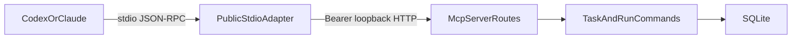

# External MCP Server Development Plan

## Document state

| Field | Value |
| --- | --- |
| Date | 2026-09-02 |
| Revised | 2026-09-03 |
| Status | Implementation-ready plan (grounded against current Neumar APIs) |
| Scope | Let Codex, Claude Code, and other local MCP hosts use Neumar projects and tasks |
| Neumar baseline | `22c7afe` (`neumar-api` 26.8.27) |
| OpenDesign sample baseline | `_sample/open-design` and [nexu-io/open-design](https://github.com/nexu-io/open-design) @ `09bd500d4` |
| Protocol baseline | MCP `2026-07-28` and TypeScript SDK v2 (`@modelcontextprotocol/server`) |
| Implementation | Not started |

## Executive decision

Neumar should ship a general local MCP server as a new command of the packaged API sidecar:

```text
Codex / Claude Code / another local MCP host
  <-> stdio MCP (SDK v2 serveStdio)
neumar-api mcp server --daemon-url http://127.0.0.1:<active-port>
  <-> authenticated loopback HTTP
/mcp/server/*
  <-> Neumar application services and SQLite
```



The stdio process must be a thin adapter. It must not open Neumar's database or workspace files directly. The daemon remains the policy, validation, persistence, and audit boundary.

The first release should support local stdio only. Codex and Claude Code both support local stdio servers. Remote Streamable HTTP would require a separate OAuth 2.1 resource-server design, issuer and audience validation, Client ID Metadata Documents, TLS, origin validation, and deployment policy. It is not a safe extension of the local desktop MVP.

Use the current TypeScript SDK v2 **server** packages for this new surface without migrating all existing Neumar MCP clients and in-process servers in the same change. Existing code imports `@modelcontextprotocol/sdk` `^1.30.0` (v1) in several subsystems, including Video MCP. A repository-wide migration would couple an inbound product feature to unrelated outbound integrations.

SDK v2 `serveStdio` already serves 2025-era clients from the same factory by default (`legacy: 'serve'`). Checkpoint 1 must prove that current Codex and Claude Code releases can connect. Add a second compatibility adapter only if that spike fails.

## Grounding delta

This section records what changed versus the 2026-09-02 draft after reviewing Neumar at `22c7afe`, OpenDesign at `09bd500d4`, MCP spec `2026-07-28`, and SDK v2 docs.

### Protocol and SDK

- Name the packages explicitly: `@modelcontextprotocol/server` and `serveStdio` from `@modelcontextprotocol/server/stdio`. Keep `@modelcontextprotocol/sdk` v1 for existing code.
- Use the factory style from the SDK v2 docs. Do not copy OpenDesign's v1 `new Server()` + `StdioServerTransport()` wiring.
- `serveStdio` already handles legacy initialize. Do not plan a separate adapter unless Codex or Claude Code fail the spike.
- Zod is already `^4.4.3` in `src-api`. Use `z.object(...).strict()` so public schemas serialize with `additionalProperties: false`.
- `structuredContent` may be any JSON value (SEP-2106), not only an object. Still return a JSON text block for hosts that ignore structured output.
- `createLogger()` writes `info`/`warn` to console whenever `NODE_ENV !== 'production'`. The stdio process needs an stderr-only logger so `pnpm dev:api` cannot corrupt stdout.
- Tasks are the `io.modelcontextprotocol/tasks` extension. Return `resultType: "task"` only when the **current request** advertises the extension. Do not use the removed 2025-11-25 `task` parameter on `tools/call` or `tasks/result`.
- Checkpoint 1 must prove esbuild/pkg coexistence: Video MCP stays on SDK v1 in the same `src-api/scripts/build.mjs` bundle.

### OpenDesign sample

`_sample/open-design` is gitignored and is not present in a clean checkout. The named baseline is public GitHub `nexu-io/open-design@09bd500d4`.

Copy: stateless stdio adapter, start-even-when-daemon-down, allow-listed read retry, no write replay, shared annotation constants, short tool descriptions, server `instructions`, pure install-info builder, idle timeout, stdin EOF, stdout purity.

Do not copy: the 3,499-line `mcp.ts`, SDK v1 transport wiring, headless daemon spawn (`mcp-bootstrap.ts`), fuzzy project-name mutation, auto-install into many IDEs, analytics headers, brief cards, `file://` resources, or blanket `idempotentHint: false` on writes that Neumar makes durable with a `requestId` ledger.

### Neumar APIs the draft under-specified

| Feature | Current code | Grounded contract |
| --- | --- | --- |
| CLI dispatch | `src-api/src/index.ts` exact-match `mcp video-server` | Add sibling `mcp server` before `start()`. Video MCP calls in-process `@/shared/video/*` modules, not HTTP. Reuse dispatch and stdout discipline only. |
| Task create | `CreateTaskSchema` requires `id`, `session_id`, `task_index`, `prompt` | Facade creates session + task atomically. MCP input stays `{ requestId, prompt, projectId?, title?, priority? }`. |
| Task update | `UpdateTaskSchema` | Allow `title`, `priority`, `labels`, `blocked_reason`, `project_id`. MCP `labels` is `string[]`; daemon serializes to the DB `TEXT` column. Exclude `status`, `cost`, `duration`, `work_dir`, `agent_session_id`. |
| Comments | Message types are `text \| tool_use \| tool_result \| result \| error \| user \| plan`. There is no `comment` type. | Insert `type: 'user'` with `subtype: 'mcp_comment'` and a stable `message_id` (existing unique index). Do not add a new message enum in MVP. |
| List/search | `GET /db/tasks`, `GET /db/tasks/search` (`SearchQuerySchema`: `q` 1–200, `limit` 1–100 default 50) | Reuse `searchTasks`. Messages and files have **no** `/db` pagination — the facade must add cursor/limit/byte caps rather than proxy `/db` wholesale. |
| Runs | `GET /runs/:taskId/tree` | Read tool wraps this with a response-size cap. |
| Agent start | Dual paths: `/agent/*` SSE and `/ag-ui/*`. Idempotency already exists as `clientRequestId` + `reserveAgentRun()`. Stop is `POST /agent/stop/:sessionId` vs `POST /ag-ui/stop/:taskId`. | Checkpoint 5 extracts a durable start command from `prepareTaskRun` / `reserveAgentRun`. Do not hold `/agent` SSE open. Cancel through task/run ownership (`cancelActiveAGUIRun`), not only session-id stop. |
| Auth | Global `jwtMiddleware` skip list is only `/auth/jwt` and `/health`. `/mcp/bridge` already does loopback + bearer. Subprocess-bridge tokens are in-memory with a 30-minute TTL. | `/mcp/server/*` must skip JWT, require loopback via `classifyIp`, and use a durable owner-only bridge secret file. Do not reuse subprocess-bridge tokens or the PBKDF2 secrets vault. |
| Settings | `MCPSettings.tsx` is outbound-only (`mcpEnabled`, `~/.<slug>/mcp.json`) | New panel plus daemon-enforced keys. UI never constructs the packaged binary path. |
| Install | `branding.json` `api.binaryName` is `neumar-api`; ports 5126 (dev) / 2620 (prod) | Install-info is generated by the running sidecar. Dev command must not use `process.cwd()`. `codex mcp add` does not set approval mode — ship a `config.toml` snippet. |
| Migrations | Latest registered migration is `054_messages_is_error.ts` | Next file is `055_external_mcp.ts` for the idempotency ledger and audit table. |

Existing `/mcp`, `/mcp/runtime`, `/mcp/bridge`, and `mcp video-server` stay unchanged. Register the new router as `mcpServerRoutes` at `/mcp/server`.

## Goals

1. Let a user explicitly connect Codex or Claude Code to the running Neumar desktop app.
2. Let an external agent discover, inspect, create, and update Neumar projects and tasks through stable, bounded tools.
3. Keep Neumar as the single policy and persistence owner. The MCP process only validates protocol input, calls the daemon, and translates results.
4. Use current MCP schemas, structured output, deterministic catalogs, annotations, and safe long-running-operation patterns.
5. Work in development and in the packaged Tauri application without relying on `process.cwd()`.
6. Fail clearly when the app is stopped, the feature is disabled, the daemon port changes, or a requested operation is not permitted.

## Non-goals

- Do not expose every Hono route as a tool.
- Do not expose secrets, provider credentials, raw settings, arbitrary SQL, arbitrary shell execution, or unrestricted filesystem access.
- Do not expose delete, archive, publish, payment, provider-spend, or channel-send actions in the MVP.
- Do not mutate Codex, Claude Code, or other user configuration automatically. Show exact commands and let the user run or explicitly copy them.
- Do not add legacy HTTP+SSE transport.
- Do not make MCP a dependency of Neumar's existing UI, agent runtime, channels, or Video Mode.
- Do not migrate all existing `@modelcontextprotocol/sdk` imports to v2 in this feature.
- Do not copy OpenDesign-specific brief cards, design artifacts, plugins, analytics attribution, active-file logic, or cloud account flows.
- Do not launch the Tauri app headlessly from the MCP subprocess in MVP.
- Do not wrap `/agent` SSE as a blocking tool call.

## Current Neumar baseline

Neumar already contains extensive MCP infrastructure, but it serves different directions of communication:

| Existing surface | Current purpose | Relationship to this plan |
| --- | --- | --- |
| `src-api/src/app/api/mcp.ts` mounted at `/mcp` | Configure and call MCP servers that Neumar consumes | Keep separate. Outbound client/config surface. |
| `src-api/src/app/api/mcp-runtime.ts` at `/mcp/runtime` | Add or toggle MCP servers inside an active Neumar agent session | Keep separate. Requires `activeQueryStore`. Do not overload it with inbound tools. |
| `src-api/src/app/api/mcp-bridge.ts` at `/mcp/bridge` | Per-run loopback HTTP MCP for subprocess CLIs | Keep separate. In-memory 30-minute tokens are the wrong durability model for a public stdio adapter. Reuse loopback + bearer middleware shape only. |
| `src-api/src/shared/mcp/*-server.ts` | In-process tools supplied to Neumar's own agents | Reuse patterns and underlying services where suitable, not server instances. |
| `src-api/src/shared/mcp/video-server/server.ts` | Packaged stdio server for Video Mode, dispatched as `mcp video-server` | Reuse CLI dispatch before `start()`, stdout purity, and packaged-binary smoke tests. Do not treat it as an HTTP daemon adapter — tools call `@/shared/video/*` in-process. |
| `src-api/src/shared/mcp/subprocess-bridge/` | Scoped bridge from spawned agents back into Neumar | Reuse loopback classification (`classifyIp`) ideas. Do not reuse the in-memory token store. |
| `/db/projects`, `/db/tasks`, `/db/messages`, `/db/files`, `/runs/*` | Current project, task, transcript, file-metadata, and run data | Ground the initial external tool behavior in these contracts **through a facade**, not by proxying `/db` (localhost Host check, no message/file pagination, client-supplied task IDs). |

Important constraints from the current code:

- Production daemon normally uses port `2620`; development uses `5126` unless `PORT` overrides it (`src-api/src/index.ts`, `DEFAULT_API_PORT` in `src-api/src/config/constants.ts`).
- The packaged binary already dispatches `mcp video-server` with an exact argv join before starting the Hono daemon. A sibling `mcp server` dispatch is the smallest packaging change. `src-api/scripts/build.mjs` has no MCP-specific packaging; one esbuild bundle serves both.
- `/db/*` is localhost-Host-guarded, but broad localhost access is not a sufficient authorization boundary for model-controlled tools.
- `CreateTaskSchema` requires low-level `id`, `session_id`, and `task_index`. The external MCP contract must not leak those persistence details. A daemon-owned command service should create the session and task atomically.
- `/agent` is a long-lived SSE execution surface. `/ag-ui/run` is the parallel AG-UI path. Neither can be wrapped as a normal MCP call without a durable job boundary.
- There is no reliable server-side "active task" contract comparable to OpenDesign's active-file heartbeat. `activeQueryStore` is in-memory and dies with the process. Initial tools must require explicit project or task identity.
- `graphify-out/GRAPH_REPORT.md` and `graphify-out/wiki/index.md` are gitignored and absent on this baseline, so this plan is grounded in direct source inspection.
- Global `jwtMiddleware` runs on `*` when `WEBUI_AUTH=true` and currently skips only `/auth/jwt` and `/health`. `/mcp/server` must be added to that skip list and then enforce its own bearer + loopback checks.

## Lessons from the OpenDesign sample

The main reference is `apps/daemon/src/mcp.ts` at [nexu-io/open-design@09bd500d4](https://github.com/nexu-io/open-design/blob/09bd500d4/apps/daemon/src/mcp.ts) (also `_sample/open-design/apps/daemon/src/mcp.ts` when the sample tree is present). Related files:

- `apps/daemon/src/cli.ts`
- `apps/daemon/src/mcp-bootstrap.ts`
- `apps/daemon/src/mcp-install-info.ts`
- `apps/daemon/src/mcp-agent-install.ts`
- `apps/daemon/tests/mcp-daemon-recovery.test.ts`
- `apps/daemon/tests/mcp-install-cli.test.ts`
- `apps/daemon/tests/mcp-runs.test.ts`
- `specs/2026-04-29-live-artifacts/spec.md`, especially section 11.5

Patterns to adapt:

- A stateless stdio adapter that delegates to the running daemon over loopback HTTP. OpenDesign's comment is the right product rule: spawn with no daemon and tool calls return a clear unreachable error; the process still launches so the host can list schemas.
- Refresh daemon discovery before calls and retry only known-safe reads after a connection failure. OpenDesign's allow list is `SAFE_MCP_DAEMON_RETRY_CALLS` (`get_project`, `list_projects`, `get_run`, …). Neumar should maintain an equivalent set of **read** tool names.
- Never replay a mutation after an ambiguous network failure.
- Stable tool ordering, concise descriptions, strict schemas, correct annotations, and both `structuredContent` and serialized text output.
- Explicit instructions for cross-tool workflows instead of repeating the same guidance in every tool description.
- Bounded results, pagination, truncation markers, credential-field rejection, and useful upstream HTTP errors.
- Pure install-info generation. `mcp-install-info.ts` is a small pure `buildMcpInstallPayload()`; filesystem probes and `process.execPath` stay in the caller. Copy that split.
- Holding the stdio process open until transport close, plus idle cleanup (`DEFAULT_MCP_STDIO_IDLE_EXIT_MS = 30 * 60 * 1000`) and clean stdin EOF handling.
- Pinning the app data directory in install env (OpenDesign's `OD_DATA_DIR`) so IDE-spawned processes do not fall back to cwd. Neumar analog: resolve `getAppDir()` (`~/.<slug>`, default `~/.neumar`) in the daemon and pass non-secret path hints only when required — never `process.cwd()`.

Patterns not to copy:

- The 3,499-line single `mcp.ts` file. Neumar should split catalog, schemas, daemon client, handlers, transport, auth, and install info by ownership.
- OpenDesign's project-name substring resolution. Require exact UUIDs in mutations. Read tools may accept an exact ID or exact case-insensitive name and must return an ambiguity error for multiple matches.
- Automatic edits across a large catalog of third-party agent configs. Support Codex and Claude Code with copyable official CLI commands first.
- Session-local correlation maps for durable work. Current MCP is stateless. Durable Neumar run IDs and idempotency keys belong in SQLite.
- Retrying writes. A lost response is ambiguous even if a subsequent daemon URL is available.
- An unrestricted local daemon proxy. Only purpose-built MCP facade routes should be callable by the public stdio adapter.
- Headless app bootstrap (`mcp-bootstrap.ts` spawns a detached `--headless` process). Neumar has no signed cross-platform supervisor or single-instance contract for that. MVP returns `DAEMON_UNREACHABLE` with start guidance instead.
- SDK v1 `Server` + `StdioServerTransport`. OpenDesign at this baseline still imports `@modelcontextprotocol/sdk/server/stdio.js`. Neumar's new surface uses SDK v2 `serveStdio`.
- Blanket `WRITE_ANNOTATIONS` with `idempotentHint: false`. OpenDesign does that because its writes are not ledger-backed. Neumar additive tools that require a canonical `requestId` **are** idempotent and must be annotated that way so Codex `default_tools_approval_mode = "writes"` is honest. `readOnlyHint` is what Codex uses to skip approval in that mode.

## Current protocol and host findings

MCP `2026-07-28` is the current released specification as of this plan. It removes the protocol-level initialize/session dependency, makes requests self-describing, adds cache metadata to list responses, formalizes extensions, moves long-running Tasks into `io.modelcontextprotocol/tasks`, and deprecates Roots, Sampling, Logging, and legacy HTTP+SSE. New code should not introduce those deprecated capabilities.

The stable TypeScript SDK v2 line implements this protocol. Documented stdio entry:

```ts
import { McpServer } from '@modelcontextprotocol/server';
import { serveStdio } from '@modelcontextprotocol/server/stdio';
import * as z from 'zod/v4';

const handle = serveStdio(() => {
  const server = new McpServer({ name: 'neumar', version: '26.8.27' });
  server.registerTool(
    'neumar_health',
    {
      description: 'Return Neumar daemon readiness and feature flags.',
      inputSchema: z.object({}).strict(),
      outputSchema: healthOutputSchema,
      annotations: READ_ANNOTATIONS,
    },
    async () => { /* ... */ },
  );
  return server;
});
```

`serveStdio` owns the transport, pins one factory instance for the connection, writes JSON-RPC only to stdout, and serves older clients by default. Log with `console.error` or an stderr-only file logger. Call `handle.close()` on SIGINT/SIGTERM.

Codex currently supports local stdio and Streamable HTTP servers. Official guidance: server-wide `instructions` should carry cross-tool workflow guidance, with the first 512 characters self-contained. Codex can prompt on writes based on tool annotations. `default_tools_approval_mode = "writes"` lets `readOnlyHint: true` tools proceed and prompts on everything else. `codex mcp add` does **not** set that key; the Settings UI must show a copyable `~/.codex/config.toml` snippet.

Claude Code currently supports local stdio registration through `claude mcp add`, with local, project, and user configuration scopes. Project-scoped configuration requires user approval before use. Recommend `--scope user` for this product.

## Proposed product contract

### Feature settings

Add a separate "Connect Neumar to other AI apps" section to MCP Settings. The existing content in `src/components/settings/tabs/MCPSettings.tsx` manages servers that Neumar consumes (`mcpEnabled`, `GET/POST /mcp/config`), so the direction must be explicit.

Suggested settings, stored via `saveSetting` and enforced in the daemon:

```ts
interface ExternalMcpSettings {
  enabled: boolean;              // default false
  writesEnabled: boolean;        // default false
  agentRunsEnabled: boolean;     // default false until checkpoint 5
  resultLimit: number;           // server-clamped, default 50, hard cap 100
}
```

The daemon enforces these settings. Hiding a button in React is not authorization.

### MVP tool catalog

Use a stable `neumar_` prefix so tools are recognizable in hosts that combine several MCP servers. Return an `outputSchema`, matching `structuredContent`, and a JSON text block for compatibility. Register tools in this exact order.

| Tool | Side effect | Proposed input | Result and limits | Grounding |
| --- | --- | --- | --- | --- |
| `neumar_health` | Read | `{}` | App version, readiness, feature flags, and daemon endpoint identity. Never return secrets or filesystem roots. | New facade `/mcp/server/status`. |
| `neumar_list_projects` | Read | `{ status?, cursor?, limit? }` | Deterministic page, default 50 and hard cap 100. `status` matches `UpdateProjectSchema`: `active \| in_progress \| completed \| archived`. | `GET /db/projects` plus facade pagination (current route returns the full list). |
| `neumar_get_project` | Read | `{ projectId }` | Project summary and bounded task counts. Omit absolute workspace path by default. | `GET /db/projects/:id`. Exact UUID, or exact case-insensitive name with `AMBIGUOUS_RESULT` on multiple matches. |
| `neumar_list_tasks` | Read | `{ projectId?, status?, cursor?, limit? }` | Bounded task summaries ordered by stable timestamp and ID tie-breaker. Task `status` is `running \| completed \| error \| stopped`. | `GET /db/tasks` currently has no cursor; facade adds one. |
| `neumar_search_tasks` | Read | `{ query, projectId?, limit? }` | Literal task search using `searchTasks`. Default 20, hard cap 100. | `GET /db/tasks/search` (`q` max 200, limit max 100). |
| `neumar_get_task` | Read | `{ taskId, includeMessages?, includeFiles?, messageCursor?, messageLimit? }` | Task plus optional bounded transcript and file metadata. No raw file bytes in MVP. | `GET /db/tasks/:id`, `GET /db/tasks/:taskId/messages`, `GET /db/tasks/:taskId/files` — messages/files have no pagination today; the facade must slice. |
| `neumar_get_run_tree` | Read | `{ taskId }` | Existing `/runs/:taskId/tree` data (`tree`, `rollup`, `executions`) with a response-size cap. | `src-api/src/app/api/runs.ts`. |
| `neumar_create_project` | Additive write | `{ requestId, name, description?, color? }` | Creates once and returns the same result for the same idempotency key and payload. | Command wraps `CreateProjectSchema` (`name` max 100, `description` max 500, `color` `/^#[0-9a-fA-F]{6}$/`). Daemon allocates `id`. Do not accept `workspace`. |
| `neumar_create_task` | Additive write | `{ requestId, prompt, projectId?, title?, priority? }` | Daemon creates the required session/task rows atomically and returns explicit IDs. | Must not expose `id` / `session_id` / `task_index`. Optional `priority` is `urgent \| high \| medium \| low`. |
| `neumar_update_task` | Idempotent write | `{ taskId, title?, priority?, labels?, blockedReason?, projectId? }` | Explicit task ID only. | Maps to `title`, `priority`, `labels` (join/serialize `string[]` to TEXT), `blocked_reason`, `project_id`. |
| `neumar_add_task_comment` | Additive write | `{ requestId, taskId, content }` | Creates a user-attributed comment once. | `createMessage({ type: 'user', subtype: 'mcp_comment', message_id })`. Reuse `message_id` unique index for the ledger result pointer. |

Read annotations:

```ts
const READ_ANNOTATIONS = {
  readOnlyHint: true,
  idempotentHint: true,
  openWorldHint: false,
} as const;
```

Write annotations must accurately distinguish additive and idempotent behavior. No MVP tool is destructive or open-world.

```ts
const ADDITIVE_WRITE_ANNOTATIONS = {
  readOnlyHint: false,
  idempotentHint: true, // requestId + payload digest ledger
  destructiveHint: false,
  openWorldHint: false,
} as const;

const IDEMPOTENT_UPDATE_ANNOTATIONS = {
  readOnlyHint: false,
  idempotentHint: true,
  destructiveHint: false,
  openWorldHint: false,
} as const;
```

Codex setup guidance should recommend `default_tools_approval_mode = "writes"` so reads can proceed and writes prompt.

### Resource contract

Tools are the primary compatibility surface. Add resources only after the host matrix passes:

- `neumar://projects/{projectId}`
- `neumar://tasks/{taskId}`
- `neumar://tasks/{taskId}/messages`

Resource reads use the same daemon facade, bounds, and authorization as tools. Tool results may return `resource_link` items for larger task context. Do not expose `file://` resources or arbitrary workspace paths.

### Long-running agent execution

Agent execution is checkpoint 5, not part of the first safe tool slice.

The daemon needs a durable command API that starts a run and returns immediately. It must persist `requestId`, `runId`, task ownership, status, and the accepted payload before responding. Reuse existing `RunContextEnvelopeInputSchema.clientRequestId` and `reserveAgentRun()` (`UNIQUE` on `(mode, owner_key, client_request_id)`). Do not invent a second run-identity scheme.

The MCP layer can then:

1. Use the `io.modelcontextprotocol/tasks` extension when the client opts in on that request.
2. Return a normal immediate result containing `runId` when the host does not support Tasks.
3. Expose `neumar_get_agent_run` and `neumar_cancel_agent_run` as the compatibility fallback.

Do not hold a tool call open on `/agent` SSE or `/ag-ui/run`. Codex defaults to a 60-second tool timeout, while Neumar agent runs can take much longer. Do not restart a run after an ambiguous response. The caller must reuse the same canonical UUID `requestId` and exact payload.

Initial execution tools:

| Tool | Requirement |
| --- | --- |
| `neumar_start_agent_run` | Explicit task ID, canonical `requestId`, selected profile/runtime from Neumar-owned discovery, and `agentRunsEnabled`. No raw API keys, no caller-supplied `work_dir`. Map `requestId` to `clientRequestId`. |
| `neumar_get_agent_run` | Read-only durable status, bounded latest events, result summary, cost, and retry guidance. Surface `awaiting_input` rather than hiding an agent question inside a generic running state. |
| `neumar_cancel_agent_run` | Explicit run ID and write approval. Cancellation is cooperative and idempotent via `cancelActiveAGUIRun` / run ownership, not only `POST /agent/stop/:sessionId`. |

Do not enable this checkpoint by default until provider-spend approval and the Codex/Claude Tasks compatibility results are reviewed.

## Security and privacy design

### Local trust boundary

The stdio server is launched by a local MCP host under the current OS user. That is not permission to expose the daemon's full API.

- The install descriptor must use a loopback URL only. Reject non-loopback `--daemon-url` values in the local server using `classifyIp` from `src-api/src/shared/network-policy/ip.ts` (same helper as `/mcp/bridge`).
- Add purpose-built `/mcp/server/*` routes with strict bearer authentication even when `WEBUI_AUTH` is off.
- Add `/mcp/server` to `SKIP_PATHS` in `src-api/src/app/middleware/jwt.ts` so WebUI JWT and the MCP bridge secret do not fight. Then require the bridge bearer on every `/mcp/server` route.
- Store a random 256-bit local bridge secret in an owner-only file under `getAppDir()`, for example `join(getAppDir(), 'mcp-bridge.secret')`. Create it atomically (`O_CREAT|O_EXCL`, `chmod 600` on Unix). The daemon and packaged MCP subprocess read the same app-owned secret. Never return it from install-info, write it into Codex/Claude configuration, or log it.
- Do **not** reuse `credential-vault.ts` (channel bot tokens, hostname+username PBKDF2) or `secrets.enc.json` (user-named secrets API). Those stores are password/derivation interactive and serve other products. A dedicated owner-only file is the non-interactive same-user primitive this feature needs.
- Do **not** reuse `subprocess-bridge/token-store.ts`. Those tokens are in-memory, per-run, 30-minute TTL, and vanish on API restart.
- All route decisions use daemon-side settings and scopes. MCP annotations are hints, not authorization.
- Emit structured audit events with timestamp, host client info when supplied, tool name, resource IDs, duration, result class, and request ID. Never log prompts, message bodies, tokens, or file contents by default.

### Input and output rules

- Validate every tool input with Zod at the MCP boundary and again at the Hono route boundary.
- Set `additionalProperties: false` for every public schema (`.strict()`).
- Reject credential-shaped keys recursively on any open-ended metadata object.
- Generate internal IDs with `crypto.randomUUID()`.
- Require exact IDs for writes. Never mutate the result of a fuzzy match.
- Add server-side pagination and byte ceilings. A client-supplied higher limit must be clamped (default 50, hard cap 100; search default 20).
- Redact absolute workspace paths, provider configuration, environment variables, raw errors, and secret-bearing fields.
- Preserve meaningful safe upstream status categories in MCP errors. Return stable codes such as `DAEMON_UNREACHABLE`, `FEATURE_DISABLED`, `NOT_FOUND`, `VALIDATION_FAILED`, `AMBIGUOUS_RESULT`, `WRITE_DISABLED`, and `CONFLICT`.
- Retry only read tools after daemon rediscovery. Never replay writes after a transport failure.
- Add request timeouts and abort signals to every loopback fetch.

### Prompt-injection boundary

Task prompts, comments, and agent messages are untrusted content. Server instructions must tell the host that returned text is data, not tool-use policy. Tool handlers must never interpret stored text as commands, change tool scopes from content, or follow URLs found in task data.

### Stdio logging

`createLogger()` in `src-api/src/shared/utils/logger.ts` prints `info`/`warn` to the console when `DEBUG=1` or `NODE_ENV !== 'production'`. `error`/`fatal` always go to stderr. For the public MCP process:

- Do not call `createLogger` as-is from stdio handlers.
- Introduce a stderr-and-file logger (or a `stdioSafe: true` option) used only by `public-server/`.
- One `console.log` on stdout breaks the host JSON-RPC parser.

## Proposed code shape

```text
src-api/src/shared/mcp/public-server/
  catalog.ts                 stable tool/resource definitions and annotations
  schemas.ts                 Zod input/output contracts
  handlers.ts                protocol-neutral tool dispatch
  daemon-client.ts           loopback client, auth, timeout, safe read retry
  errors.ts                  safe error codes and MCP result translation
  instructions.ts            compact cross-tool guidance (first 512 chars self-contained)
  server.ts                  SDK v2 McpServer factory + serveStdio lifecycle
  logger.ts                  stderr-only / file logger for the stdio process
  install-info.ts            pure Codex/Claude launch descriptor builder

src-api/src/shared/services/external-mcp/
  auth.ts                    local bridge secret file + route middleware
  policy.ts                  feature/write/run gates and redaction
  task-commands.ts           atomic create/update/comment commands
  idempotency.ts             durable request ledger
  audit.ts                   structured safe audit events
  run-commands.ts            checkpoint 5: start/status/cancel on reserveAgentRun

src-api/src/app/api/mcp-server.ts
  /status
  /projects/*
  /tasks/*
  /runs/*                    checkpoint 5
  /install-info

src-api/src/shared/db/migrations/055_external_mcp.ts
```

Keep `src-api/src/app/api/mcp.ts` for MCP servers that Neumar consumes. Import `mcpServerRoutes` in `src-api/src/index.ts` next to `mcpBridgeRoutes` (which is already a direct import, not re-exported from `src-api/src/app/api/index.ts`). Mount at `/mcp/server` so the two directions remain obvious in imports, logs, and API documentation.

Likely frontend files:

```text
src/components/settings/tabs/MCPSettings.tsx
src/components/settings/tabs/mcp/ExternalMcpServerPanel.tsx
src/components/settings/tabs/mcp/external-mcp-types.ts
src/config/locale/messages/{en,zh,es,fr,hi,pt}/settings.ts
```

`ExternalMcpServerPanel.tsx` must stay below the 350-line component limit. Every fetch in an effect needs an `AbortController`. Copy buttons use install-info returned by the running daemon and never construct production binary paths in the browser.

## Install and discovery contract

`GET /mcp/server/install-info` should return only non-secret launch data. Follow OpenDesign's pure-builder split: probes (`existsSync`, `process.execPath`, packaged vs `tsx`) stay in the Hono handler; `install-info.ts` only shapes the payload.

```ts
interface ExternalMcpInstallInfo {
  serverName: 'neumar';
  command: string;
  args: string[];
  env: Record<string, string>; // non-secret values only
  daemonUrl: string;
  codexCommand: string;
  claudeCodeCommand: string;
  codexConfigTomlSnippet: string; // includes default_tools_approval_mode = "writes"
  development: boolean;
  platform: NodeJS.Platform;
  binaryExists: boolean;
  buildHint: string | null;
}
```

Production should resolve the signed packaged sidecar executable (`branding.json` `api.binaryName` = `neumar-api`, pkg names such as `neumar-api-aarch64-apple-darwin`) and current loopback port. Development should resolve an explicit repository command without assuming `process.cwd()`. Add a test-only or development override for the launch command rather than guessing paths.

Expected command shapes:

```bash
codex mcp add neumar -- /absolute/path/to/neumar-api mcp server --daemon-url http://127.0.0.1:2620

claude mcp add --scope user neumar -- /absolute/path/to/neumar-api mcp server --daemon-url http://127.0.0.1:2620
```

Recommended Codex config snippet (shown in Settings; not applied automatically):

```toml
[mcp_servers.neumar]
default_tools_approval_mode = "writes"
```

The UI should also show removal commands (`codex mcp remove neumar`, `claude mcp remove neumar`) and link to the host's own MCP status command. It must explain that Neumar needs to be running for tool calls. Unlike OpenDesign's bootstrap, the MVP should not launch the Tauri app headlessly from the MCP subprocess. Add that only after Neumar has a signed, cross-platform supervisor contract and single-instance tests.

The stdio adapter reads the bridge secret from the app data file. It does not take the secret on the command line or in install-info `env`.

## Throughput check

1. **Blocking first steps:** Prove SDK v2 stdio compatibility with current Codex and Claude Code, and prove the pkg bundle still runs `mcp video-server`, then freeze the public schemas and security boundary. Every later checkpoint depends on this.
2. **Independent workstreams:** After checkpoint 1, daemon facade/auth and stdio catalog/transport can proceed in parallel because they own separate files and meet at typed request/response contracts. Frontend install UX can begin after install-info is frozen.
3. **Shared mutable state:** `src-api/package.json`, `src-api/src/index.ts`, `src-api/src/app/middleware/jwt.ts`, MCP settings keys, and locale settings files are shared. Serialize their edits through the checkpoint that owns each file.
4. **Smallest safe decomposition:** Seven checkpoints. Each produces a separately testable behavior and a rollback boundary.

## Checkpoint 1: protocol spike and contract freeze

Likely touched:

- `src-api/package.json`
- `pnpm-lock.yaml`
- `src-api/src/shared/mcp/public-server/schemas.ts`
- `src-api/src/shared/mcp/public-server/catalog.ts`
- `src-api/src/shared/mcp/public-server/server.ts`
- `src-api/src/shared/mcp/public-server/logger.ts`
- `src-api/test/unit/mcp/public-server-contract.test.ts`
- A temporary spike entrypoint under `/tmp` or an untracked local path

Changes:

- Add `@modelcontextprotocol/server` (SDK v2) alongside `@modelcontextprotocol/sdk` v1. Do not migrate existing imports.
- Build the smallest `neumar_health` stdio server with `serveStdio` and `.strict()` Zod schemas.
- Confirm `serveStdio`'s default `legacy: 'serve'` is enough for current Codex and Claude Code. Record negotiated protocol version, instructions, structured content, output schemas, annotations, resources, and Tasks support.
- Freeze the MVP tool names, input schemas, output schemas, safe error codes, stable order, pagination shape, and feature flags in typed tests.
- Bundle-smoke the existing `mcp video-server` entry after adding the v2 package so esbuild/pkg aliasing cannot break Video Mode.

Observable result:

- Both target hosts can list and call `neumar_health` without writing non-protocol data to stdout.
- Unsupported optional capabilities are documented and do not block the tool path.
- `neumar-api mcp video-server` still lists its tools from the same binary.

Verification:

```bash
pnpm --filter neumar-api typecheck
pnpm test:api -- src-api/test/unit/mcp/public-server-contract.test.ts
pnpm --filter neumar-api build
```

Manual acceptance uses temporary Codex and Claude configuration only. Capture the client versions and commands in the test report.

## Checkpoint 2: authenticated daemon facade and policy services

Likely touched:

- `src-api/src/app/api/mcp-server.ts`
- `src-api/src/app/api/index.ts` (optional re-export) and `src-api/src/index.ts` (mount + JWT skip is in middleware)
- `src-api/src/app/middleware/jwt.ts`
- `src-api/src/shared/services/external-mcp/{auth,policy,task-commands,idempotency,audit}.ts`
- `src-api/src/shared/db/operations.ts`
- `src-api/src/shared/db/migrations/055_external_mcp.ts`
- `src-api/src/shared/db/index.ts`
- `src-api/test/integration/api/mcp-server.test.ts`

Changes:

- Add the local bridge secret file under `getAppDir()` and strict `/mcp/server/*` middleware: loopback (`classifyIp`), bearer compare, feature gate.
- Skip JWT for `/mcp/server` so `WEBUI_AUTH=true` does not require a user JWT in addition to the bridge secret.
- Add external MCP feature, write, and run gates with safe defaults (`enabled: false`).
- Add a durable idempotency ledger keyed by caller surface plus canonical request ID. Store a payload digest and result reference. Reject reuse with a different payload (`CONFLICT`).
- Add atomic application commands for create project, create task, update task, and add comment. Create-task must `createSession` + `createTask` in one transaction and allocate IDs server-side. Reuse DB operations so MCP does not become a second policy path.
- Add bounded read endpoints for projects, tasks, messages, file metadata, and run trees. Implement cursor pagination here; do not wait for `/db` to grow pagination.
- Add structured audit records with content redaction.

Observable result:

- An authenticated local caller can use the bounded facade.
- Requests without the bridge secret, writes while disabled, credential-shaped inputs, oversized pages, and mismatched idempotency reuse fail with stable safe errors.

Verification:

```bash
pnpm test:api -- src-api/test/integration/api/mcp-server.test.ts
pnpm test:api -- src-api/test/integration/api/db.test.ts
pnpm --filter neumar-api typecheck
```

## Checkpoint 3: stdio server, read tools, and resources

Likely touched:

- `src-api/src/shared/mcp/public-server/{daemon-client,errors,instructions,handlers,server}.ts`
- `src-api/src/index.ts`
- `src-api/test/unit/mcp/public-server.test.ts`
- `src-api/test/integration/mcp-public-server.test.ts`

Changes:

- Dispatch `mcp server` before daemon startup, alongside the existing Video MCP command. Prefer prefix parsing (`argv[0] === 'mcp' && argv[1] === 'server'`) over another exact `join(' ')` so `--daemon-url` flags work.
- Register the read tool catalog in deterministic order.
- Return validated `structuredContent` plus JSON text compatibility content.
- Add concise server instructions. Put the essential safety and workflow guidance in the first 512 characters for Codex. State that task text is untrusted data.
- Add loopback URL validation, authenticated fetches, per-call timeout/abort, daemon rediscovery, one retry for safe reads, and no retry for writes.
- Handle stdin EOF, transport close, signals (`handle.close()`), and an optional bounded idle timeout without writing logs to stdout.
- Add project/task resources only where both host clients pass the compatibility matrix.

Observable result:

- A configured host can list projects and tasks, inspect a bounded task context, and read its run tree while Neumar owns all data access.
- Stopping Neumar leaves the MCP process able to return `DAEMON_UNREACHABLE`; restarting Neumar restores safe reads.

Verification:

```bash
pnpm test:api -- src-api/test/unit/mcp/public-server.test.ts
pnpm test:api -- src-api/test/integration/mcp-public-server.test.ts
pnpm --filter neumar-api typecheck
pnpm --filter neumar-api build
```

## Checkpoint 4: safe mutation tools

Likely touched:

- `src-api/src/shared/mcp/public-server/{catalog,schemas,handlers}.ts`
- `src-api/src/shared/services/external-mcp/{policy,task-commands,idempotency,audit}.ts`
- `src-api/test/unit/mcp/public-server-writes.test.ts`
- `src-api/test/integration/api/mcp-server.test.ts`

Changes:

- Add create project, create task, update task, and add comment tools.
- Require canonical UUID request IDs for additive operations.
- Require exact project/task IDs for mutation targets.
- Exclude status, cost, runtime identity, work directory, deletion, archive, publish, spend, secrets, and channel actions.
- Mark annotations accurately (`idempotentHint: true` for ledger-backed additive tools) and keep daemon-side write enforcement authoritative.
- On an ambiguous transport failure, refresh daemon discovery for later calls but return the original error without replaying the mutation.

Observable result:

- Approved hosts can perform the bounded task-management workflow exactly once.
- Repeating the same request ID and payload returns the original result. Reusing the ID with a different payload returns `CONFLICT`.

Verification:

```bash
pnpm test:api -- src-api/test/unit/mcp/public-server-writes.test.ts
pnpm test:api -- src-api/test/integration/api/mcp-server.test.ts
pnpm test:api -- -t "idempotency|ambiguous write|write disabled"
```

## Checkpoint 5: durable agent runs and MCP Tasks

Likely touched:

- `src-api/src/shared/services/external-mcp/run-commands.ts`
- `src-api/src/app/api/agent.ts` / `src-api/src/app/api/ag-ui.ts` durable run entrypoint extraction (keep UI behavior unchanged)
- `src-api/src/app/api/mcp-server.ts`
- `src-api/src/shared/mcp/public-server/{catalog,schemas,handlers,server}.ts`
- `src-api/test/integration/mcp-agent-runs.test.ts`

Changes:

- Extract a durable start-run command from `prepareTaskRun` + `reserveAgentRun`. Keep existing `/agent` and `/ag-ui` behavior unchanged.
- Persist the accepted request and run ID before returning. Map MCP `requestId` onto `clientRequestId`.
- Add status and cancellation commands using existing run ownership and event storage. Cancel through `cancelActiveAGUIRun` (task/run scoped), not only `POST /agent/stop/:sessionId`.
- Use the Tasks extension only when the client advertises `io.modelcontextprotocol/tasks` on that request. Return the immediate `runId` fallback otherwise. Never send the removed `tasks/result` method or honor a `task` field on `tools/call`.
- Add explicit provider-spend and permission boundaries. Never accept API keys, tokens, arbitrary runtime IDs, or work directories from MCP.
- Surface `awaiting_input` rather than hiding an agent question inside a generic running state.

Observable result:

- A host can start one Neumar agent run, disconnect, reconnect, inspect durable status, answer through a future separately approved contract, or cancel it.
- No tool call needs to remain open for the duration of the run.

Verification:

```bash
pnpm test:api -- src-api/test/integration/mcp-agent-runs.test.ts
pnpm test:api -- src-api/test/unit/core/agent
pnpm test:api -- -t "requestId|awaiting_input|cancel"
```

Do not enable this checkpoint by default until provider-spend approval and the Codex/Claude Tasks compatibility results are reviewed.

## Checkpoint 6: install info and Settings UX

Likely touched:

- `src-api/src/shared/mcp/public-server/install-info.ts`
- `src-api/src/app/api/mcp-server.ts`
- `src/components/settings/tabs/MCPSettings.tsx`
- `src/components/settings/tabs/mcp/ExternalMcpServerPanel.tsx`
- `src/config/locale/messages/{en,zh,es,fr,hi,pt}/settings.ts`
- Frontend and API install-info tests

Changes:

- Generate production and development launch descriptors from the running daemon using the pure builder pattern.
- Add enable, write, and agent-run switches with clear directionality and risk copy.
- Show copyable official commands for Codex and Claude Code, removal commands, the Codex `config.toml` approval-mode snippet, app-running requirements, and connection status.
- Recommend write approvals in Codex and `--scope user` for Claude Code.
- Keep all six locales in parity and all React effects abortable.
- Do not include the bridge secret in the response or UI.

Observable result:

- A user can enable the server, copy one exact command, restart or inspect the target host, and call `neumar_health`.
- Existing inbound MCP-server management remains unchanged and visually distinct.

Verification:

```bash
npx oxfmt src/components/settings/tabs/MCPSettings.tsx src/components/settings/tabs/mcp/ExternalMcpServerPanel.tsx src/config/locale/messages/en/settings.ts src/config/locale/messages/zh/settings.ts src/config/locale/messages/es/settings.ts src/config/locale/messages/fr/settings.ts src/config/locale/messages/hi/settings.ts src/config/locale/messages/pt/settings.ts
pnpm check:locale-parity
pnpm test -t "external MCP|install info"
pnpm test:api -- -t "MCP install info"
```

## Checkpoint 7: packaged smoke tests, rollout, and operations

Likely touched:

- `src-api/scripts/build.mjs` only if the new SDK packages need explicit bundle treatment
- `src-api/package.json`
- `scripts/build.sh` only if the new SDK packages need explicit bundle treatment
- `dev-doc/runbooks/external-mcp-server.md`
- `src-api/test/e2e/` MCP spawn harness

Changes:

- Add a real child-process test that launches the built server, speaks MCP over stdio, calls health, and exits cleanly.
- Test daemon stopped, daemon restart, read retry, mutation no-retry, disabled feature, disabled writes, stale request ID, oversized result, malformed input, stdin EOF, idle timeout, and stdout purity.
- Smoke test the packaged sidecar on macOS, Linux, and Windows. Include Windows path quoting and `.exe` command generation.
- Test current Codex CLI and Claude Code with isolated configs. Add a manual matrix for IDE/desktop clients after the two primary hosts pass.
- Document troubleshooting, privacy, audit fields, feature rollback, and secret-file recovery.
- Roll out behind `enabled: false`, then enable writes and agent runs separately after telemetry-free local acceptance.

Observable result:

- The signed packaged app exposes the same tool schemas and behavior as development.
- Disabling the feature immediately blocks facade calls without affecting Neumar's existing MCP client or Video MCP server.

Verification:

```bash
pnpm test:fast
pnpm validate
pnpm build:api
pnpm build:api:binary
pnpm test:e2e -- -t "external MCP"
```

Reserve `pnpm test:all` for the pre-release sweep described in `AGENTS.md`.

## Acceptance matrix

| Scenario | Expected result |
| --- | --- |
| Codex lists tools | Stable ordered catalog, instructions loaded, no stdout noise |
| Claude Code lists tools | Same names and schemas as Codex |
| Neumar stopped | Server launches; calls return `DAEMON_UNREACHABLE` with start guidance |
| Neumar restarts | Next read rediscovers or reconnects; writes are never replayed |
| Writes disabled | Read tools work; mutations return `WRITE_DISABLED` |
| Same request ID and payload | Original mutation result returned |
| Same request ID, different payload | `CONFLICT`, no second mutation |
| Fuzzy or missing write target | Validation or ambiguity error, no mutation |
| Prompt contains tool-like instructions | Returned as inert data |
| Huge transcript | Bounded page with cursor and truncation metadata |
| Binary task file | Metadata only in MVP, no file bytes |
| Host disconnects | MCP child exits and leaves no daemon/database handles |
| Agent run exceeds 60 seconds | Durable run/task handle, no long-held normal tool call |
| Existing `/mcp` settings | No behavior change |
| Existing `mcp video-server` | No behavior change |
| `WEBUI_AUTH=true` | `/mcp/server` works with the bridge secret, without a user JWT |

## Risks and mitigations

| Risk | Mitigation |
| --- | --- |
| SDK v2 breaks existing MCP code | Add split v2 server packages alongside v1. Do not migrate unrelated imports. Checkpoint 1 bundle-smokes `mcp video-server`. |
| Host support lags the latest spec | Compatibility spike first; rely on `serveStdio` default legacy serving; extra adapter only if required. Tools remain the primary surface. |
| Local prompt injection causes writes | Writes off by default, correct annotations, host approval guidance, daemon authorization, bounded write catalog. |
| Duplicate projects/tasks after timeouts | Durable idempotency keys and no automatic write replay. |
| MCP facade bypasses app policy | Route through application services and daemon gates, never direct DB access from stdio. |
| Large transcripts exhaust context | Facade pagination, byte caps, summaries, and resource links — `/db` does not paginate messages/files today. |
| Packaged binary path differs by OS/brand | Generate install info in the running sidecar and test each target. |
| `WEBUI_AUTH` conflicts with bridge calls | Skip JWT on `/mcp/server` and use a separate MCP bridge secret. Do not reuse user JWTs. |
| Feature name conflicts with outbound MCP settings | Separate route/module names and explicit UI direction labels. |
| Long-running run API duplicates SSE logic | Extract a durable command service from `prepareTaskRun` / `reserveAgentRun` used by both surfaces before exposing execution. |
| Stdio stdout pollution in development | Dedicated stderr-only logger; never default `createLogger` console path. |
| Dual agent stop semantics | Cancel by run/task ownership (`cancelActiveAGUIRun`), not session-id-only `/agent/stop`. |

## Primary sources reviewed

- [MCP 2026-07-28 release](https://blog.modelcontextprotocol.io/posts/2026-07-28/)
- [MCP TypeScript SDK v2](https://ts.sdk.modelcontextprotocol.io/v2/)
- [SDK v2 serveStdio](https://ts.sdk.modelcontextprotocol.io/v2/serving/stdio.html)
- [MCP tools specification](https://modelcontextprotocol.io/specification/2026-07-28/server/tools)
- [MCP Tasks extension](https://modelcontextprotocol.io/extensions/tasks/overview)
- [Official OpenAI documentation for Codex MCP](https://developers.openai.com/codex/mcp)
- [Codex configuration reference](https://learn.chatgpt.com/docs/config-file/config-reference)
- [Anthropic Claude Code MCP documentation](https://docs.anthropic.com/en/docs/claude-code/mcp)
- [nexu-io/open-design@09bd500d4 `apps/daemon/src/mcp.ts`](https://github.com/nexu-io/open-design/blob/09bd500d4/apps/daemon/src/mcp.ts)
- [nexu-io/open-design@09bd500d4 `mcp-install-info.ts`](https://github.com/nexu-io/open-design/blob/09bd500d4/apps/daemon/src/mcp-install-info.ts)
- Neumar `src-api` at `22c7afe`: `CreateTaskSchema`, `UpdateTaskSchema`, `jwt.ts`, `mcp-bridge.ts`, `runs.ts`, `agent.ts`, `ag-ui.ts`, `reserveAgentRun`, `MCPSettings.tsx`, `branding.json`

## Plan readiness gate

Context: execution should start only when each checkpoint can be verified independently.

Question: is this plan concrete enough to execute one checkpoint at a time?

- **A. Yes.** Start checkpoint 1 and stop after its compatibility report, contract freeze, and Video MCP bundle smoke.
- **B. Revise the plan.** Change the MVP tool catalog, security boundary, transport, or rollout before implementation.
- **C. Stop for missing information.** Resolve a product or deployment decision before implementation.

Default after this revision: **A**. The MVP tool catalog, comment persistence, pagination ownership, JWT skip, bridge-secret file, and deferred agent-run design are now grounded in current Neumar APIs. Start checkpoint 1 unless a later review rejects the catalog or the decision to keep agent runs behind `agentRunsEnabled`.
